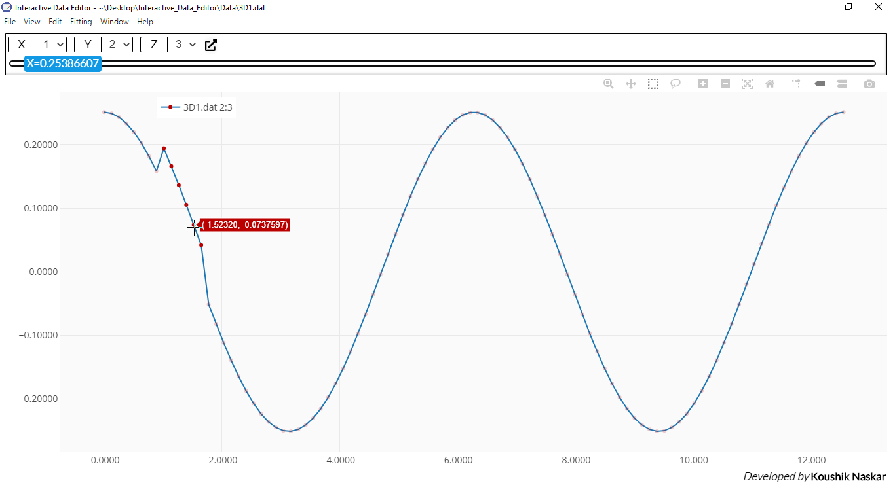

# Interactive Data Editor
### <i>A Software to interactively edit data in a graphical manner.</i>

 

  

We have all worked with data at some point of time. Now, depending on the source, sometimes the data may not be regular, smooth and uniform and requires refinement before applying for any practical use. This software lets you do that very easily and efficiently in a graphical way including many others useful data operation.

## Features
1. Edit one or multiple points by dragging with mouse and keyboard keys.
2. Automatically smooth data using spline and linear Kernel smoother.
3. Fit any function to the data.
4. Plot any 2D and gridded 3D data with LaTeX rendering support.
5. Export images in five format in any resolution.
6. Simultaneously work with multiple datasets.
7. Fill missing values.
8. Remove bad data points.
9. Repeat or mirror data any required times.
10. Filter data subject to a given condition.
11. Swap data between two lines or surfaces.
12. Supports undo/redo.
13. Change sign of any selected part of the data.
14. Spreadsheet editor with all basic excel like features including formula parsing.
 And many more...  

## Download and installation
The software is available as pre-built binaries for different platforms. Install the appropriate installer for your system available in [releases section](https://github.com/Koushikphy/Interactive-Data-Editor/releases) of this repo.  

## Gallery
Check out the software in action in this [gallery](https://koushikphy.github.io/posts/gallery.html)

## To-Do:
The software in implemented in Vanilla JS and uses a lot of codes to keep the data and UI in sync. This makes the project sometimes complicated and confusing. This process can be streamlined by using a frontend JS framework. (preferably Vue or React). But this requires to rewrite most of the protion of this project and that's why I'm not currently working on that. But wish to implement that in future. Any PR is welcome.

## Copyright and license
Copyright © July 2020, Koushik Naskar. All rights reserved.
Licensed under the MIT License.  

## Citaion
If this software was helpful in your work, please cite this project as http://doi.org/10.5281/zenodo.3745858 .

